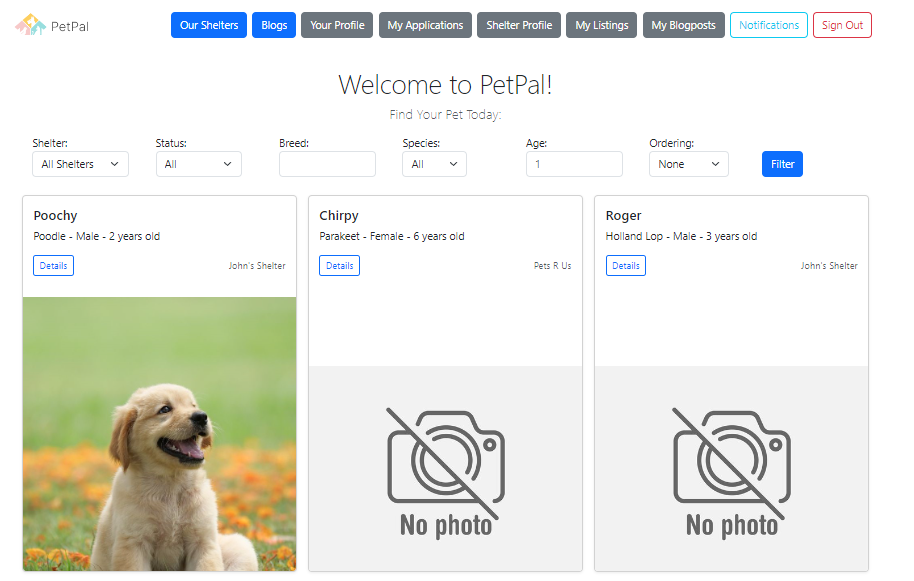
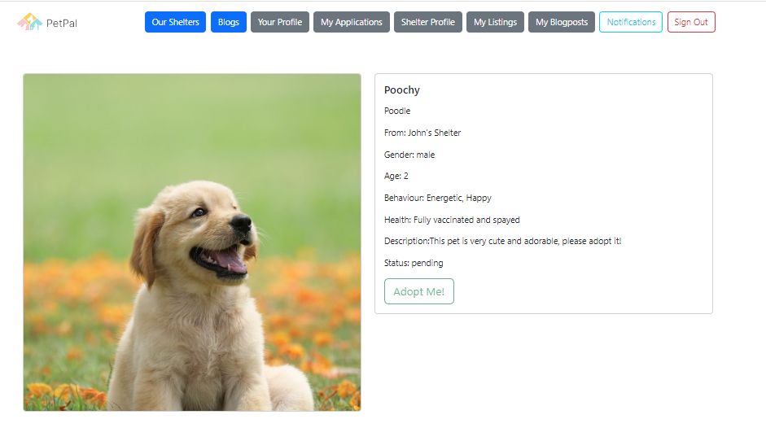

# CSC309-PetPal
Pet adoption service website for CSC309. 

This project simulates a real world pet adoption site, featuring accounts for both pet seekers and pet shelters, the ability to post, search for, and apply for pet listings, and more. There is also a separate pet blogs feature where shelters can create posts for any logged in user to view, like and comment.

Please note that we are currently in the process of deploying our project and will update this repo when that is done.

## Installation

To run this project on your local machine, please follow the instructions in the INSTALL document. Note that this project uses django rest framework for the backend and react javascript for the frontend.

## Screenshots

